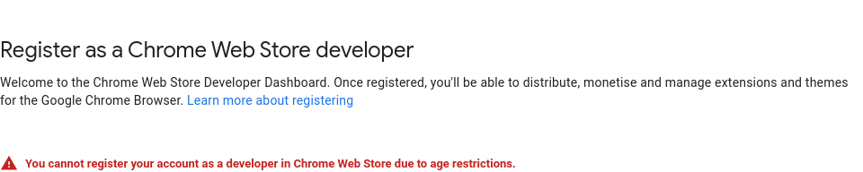

# DeSlop

Userscript and browser extension for filtering out AI slop from your YouTube feed. Blocklist-driven.

## Description

Fetches a blocklist from [GitHub](https://raw.githubusercontent.com/NikoboiNFTB/DeSlop/refs/heads/main/block/list.txt) and removes any and all videos from your feed that matches any entry on that list.

Channels that publish fully AI-generated "content" as well as channels that promote or teach how to create it qualify as AI slop, and will therefore be blocked.

## Installation

YouTube DeSlop can be installed either as:
- [A Firefox Add-on](https://addons.mozilla.org/en-US/firefox/addon/youtube-deslop/)
- [A Userscript](https://github.com/NikoboiNFTB/DeSlop/raw/refs/heads/main/userscript/deslop-1.2.user.js)
  - Userscript Managers: ([Firefox](https://addons.mozilla.org/en-US/firefox/addon/violentmonkey/)/[Chromium](https://chromewebstore.google.com/detail/tampermonkey/dhdgffkkebhmkfjojejmpbldmpobfkfo))

They do not differ in functionality.

There will **not** be a Chrome Extension. I'm not doing ts:



## Blocklist

⚠️ The list is incomplete! Your help is much appreciated! ⚠️

The blocklist can be found [here](https://raw.githubusercontent.com/NikoboiNFTB/DeSlop/refs/heads/main/block/list.txt).

Reporting channels can be done in multiple ways;

- Submitting a pull request on [GitHub](https://github.com/NikoboiNFTB/DeSlop/pulls). This is the easiest on the back-end.
  - The blocklist entries **must** be in this format:  
    ```/@NikoboiNFTB```
  - If the user has no @ username, use:  
    ```/channel/UCDI-86yEQamXmjvvxg40cIQ```
  - Basically the exact contents of href="" on the feed page.
  - Feel free to sort the entries, or not. I've included a handy [sort](https://github.com/NikoboiNFTB/DeSlop/blob/main/block/sort) script in the block folder.

- Email me at [my support email](mailto:support@nikoboi.dev) and I will add the channel manually.
  - Preferably a channel link in this case.
  - Your email will not be used for anything, ever.
    - Feel free to use any throwaway email, I don't care.

>> Google Forms for anonymous submissions coming soon!

## File Structure

```text
.
├── block
│   ├── list.txt
│   └── sort
│
├── chromium
│   ├── 1.0
│   ├── 1.1
│   └── ...
│
├── firefox
│   ├── 1.2
│   ├── 1.3
│   └── ...
│
├── userscript
│   ├── deslop-1.0.user.js
│   ├── deslop-1.1.user.js
│   └── ...
│
├── LICENSE
└── README.md

17 directories, 37 files
```

## License

This project is licenced under the GNU General Public License V3. See [LICENSE](LICENSE) for details.
